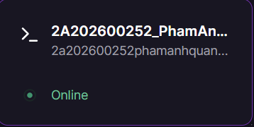
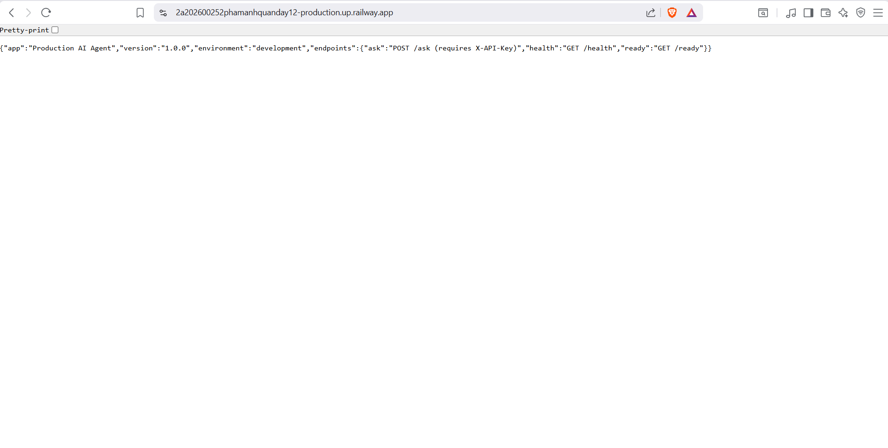
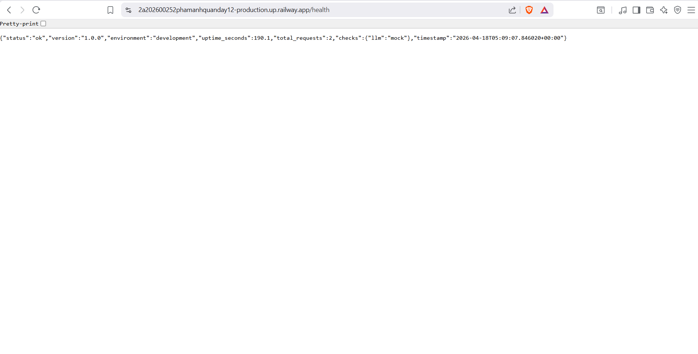

**Học viên:** 2A202600252-Phạm Anh Quân

## 1. Môi trường triển khai
- **Nền tảng Cloud:** Railway
- **Base Image Docker:** `python:3.11-slim` (Multi-stage build)
- **Tình trạng:** Thành công

## 2. Public API & Frontend URL
> **Đường link Website trực tuyến:** 
https://2a202600252phamanhquanday12-production.up.railway.app/

## 3. Nhật ký kiểm tra (Testing)

### 3.1. Theo dõi tiến trình (Dashboard)

### 3.2. Giao diện thực tế chạy trên Internet

### 3.3. Test API sức khoẻ (Health-check Probe)

---
**Cam kết:** Code triển khai trên máy chủ đảm bảo tiêu chuẩn 12-factor apps, được giới hạn Rate-limit bằng Token và đóng gói trọn vẹn qua Container.
